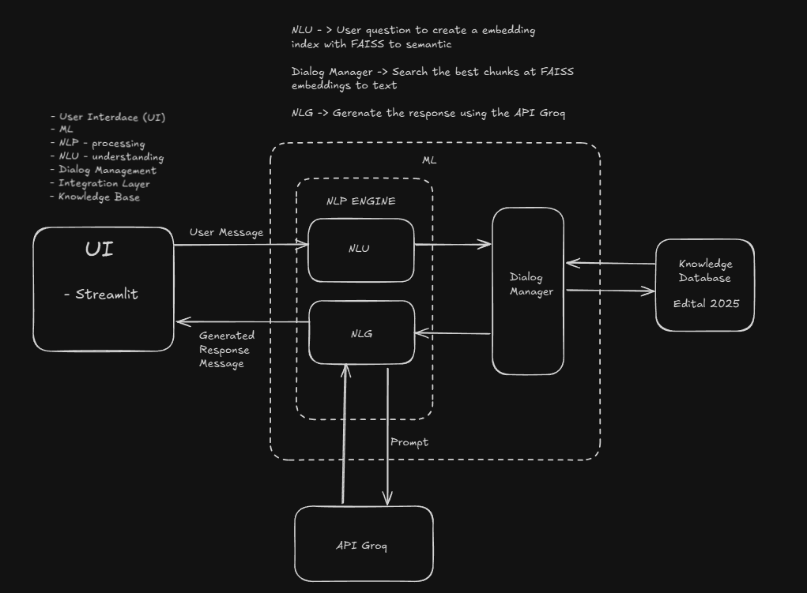

# Chatbot RAG - Vestibular Unicamp 2025

Este projeto é um chatbot desenvolvido utilizando **Retrieval-Augmented Generation (RAG)** para responder dúvidas sobre o Vestibular Unicamp 2025. Ele utiliza processamento de linguagem natural, embeddings e um índice FAISS para fornecer respostas relevantes baseadas em documentos pré-processados.
Foi utilizado o modelo llama3-70b-8192 da API do Groq.
---

## **Como configurar e usar o projeto**

Siga as instruções abaixo para configurar e executar o projeto em sua máquina local.

### **1. Clonar o repositório**

Clone este repositório para sua máquina local usando o Git:

```bash
git clone 'https://github.com/lgomesgl/chatbot-neuralmind-ps.git'
```

### **2. Criar e ativar um ambiente virtual**

Crie o ambiente virtual:
```bash
python3 -m venv venv
```

Ative o ambiente virtual:
```bash
source venv/bin/activate
```

### **3. Instalar as dependências**
Instale todas as dependências necessárias para o projeto:
```bash
pip install --upgrade pip
pip install -r requirements.txt
```

### **4. Configurar a chave de API do Groq**
Link: https://groq.com/
Este projeto utiliza uma chave de API para acessar o serviço da Groq. Para configurá-la, defina a variável de ambiente API_KEY:
```bash
export GROQ_API_KEY="sua_chave_de_api"
```

### **5. Rodar o projeto**
Inicie o chatbot utilizando o Streamlit:
```bash
cd /scr
streamlit run main.py
```

# ** System Design**


## 2.1 Interface do Usuário (UI)

A interface do usuário é o ponto de interação direta entre o chatbot e o usuário. Para isso, foi utilizada a biblioteca Streamlit, que facilita a criação de aplicações web simples e interativas. Esta escolha foi ideal, pois proporciona uma interface limpa e prática tanto para o desenvolvimento quanto para o uso.

- O usuário digita sua pergunta diretamente na interface.
- A mensagem é enviada para o sistema para ser processada.
- A resposta gerada é exibida na tela, mantendo a interação fluida.

## 2.2 Motor de Processamento de Linguagem Natural (NLP)

O motor de NLP é o núcleo responsável por entender a pergunta do usuário e gerar uma resposta adequada. Ele é dividido em dois componentes principais: NLU (Natural Language Understanding) e NLG (Natural Language Generation).

### 2.2.1 NLU (Natural Language Understanding)

O componente NLU é responsável por interpretar a pergunta do usuário. Para isso:

- A pergunta é convertida em embeddings semânticos, que são representações numéricas que capturam o significado da mensagem.
- Utiliza-se o FAISS, uma ferramenta eficiente para indexação e busca baseada em embeddings, garantindo que as perguntas sejam comparadas corretamente com os dados da base de conhecimento.

### 2.2.2 NLG (Natural Language Generation)

O componente NLG é responsável por transformar a resposta gerada em texto natural. Ele:

- Recebe os dados relevantes encontrados na base de conhecimento.
- Cria prompts bem formatados para enviar à API externa (neste caso, a API Groq).
- Retorna uma resposta clara e bem estruturada.

## 2.3 Gerenciador de Diálogo (Dialog Manager)

O Dialog Manager é o cérebro que conecta todas as partes do sistema. Ele gerencia a interação entre o NLU, o NLG e a base de conhecimento.

- Recebe a representação semântica gerada pelo NLU.
- Realiza consultas à base de conhecimento (Knowledge Database) para buscar as informações mais relevantes.
- Envia os dados filtrados para o NLG, que usa essas informações para criar a resposta.

## 2.4 Base de Conhecimento (Knowledge Database)

A base de conhecimento é essencial para que o chatbot responda perguntas sobre o Vestibular Unicamp 2025. O edital foi processado e dividido em chunks, ou pedaços menores, que podem ser pesquisados de maneira eficiente.

- Os chunks são indexados utilizando o FAISS.
- Quando o sistema recebe uma pergunta, ele busca nesses chunks o texto mais relevante para a resposta.

## 2.5 API Groq

A API Groq é a ferramenta responsável por gerar as respostas finais do chatbot. Foi utilizada por sua capacidade de processar prompts complexos e gerar textos em linguagem natural.

- O NLG envia um prompt bem estruturado com a pergunta do usuário e os dados encontrados na base de conhecimento.
- A API processa o prompt utilizando modelos como GPT-4o-mini ou Llama3-70B e retorna uma resposta final.
- Essa resposta é então enviada de volta para a interface do usuário.

## 2.6 Fluxo Geral do Sistema

O fluxo do sistema funciona da seguinte maneira:

1. O usuário envia sua pergunta pela interface.
2. O NLU processa a mensagem e gera embeddings semânticos.
3. O Dialog Manager consulta a base de conhecimento (Knowledge Database) para recuperar informações relevantes.
4. O NLG utiliza essas informações para criar um prompt, que é enviado para a API Groq.
5. A resposta gerada pela API é enviada de volta para o usuário através da interface.

# Métricas de Avaliação de Respostas Geradas

Este projeto utiliza métricas ROUGE e BLEU para avaliar a qualidade das respostas geradas em relação às respostas de referência.

## Métricas Utilizadas

### 1. **ROUGE (Recall-Oriented Understudy for Gisting Evaluation)**
A métrica ROUGE é usada para avaliar a qualidade das respostas geradas por meio da comparação entre as palavras ou sequências de palavras presentes na resposta gerada e na resposta de referência.

#### Pontuações ROUGE
- **ROUGE-1**: Mede a sobreposição de unigramas (palavras individuais) entre a resposta gerada e a resposta de referência.
- **ROUGE-2**: Mede a sobreposição de bigramas (sequências de duas palavras) entre as respostas.
- **ROUGE-L**: Calcula a sobreposição de subsequências mais longas (sequências de palavras em ordem) entre as respostas.

As pontuações ROUGE são calculadas utilizando o pacote `rouge` e retornam valores de **recall (r)**, **precision (p)** e **f-score (f)**.

### 2. **BLEU (Bilingual Evaluation Understudy)**
A métrica BLEU é utilizada para avaliar a precisão das palavras na resposta gerada, considerando n-gramas (sequências de n palavras). A pontuação BLEU compara as respostas geradas com a referência usando um sistema de penalização para evitar respostas excessivamente curtas e não informativas.

A pontuação BLEU é calculada usando o pacote `nltk.translate.bleu_score` e retorna um valor numérico entre 0 e 1, sendo 1 a pontuação máxima indicando uma correspondência perfeita entre a resposta gerada e a de referência.

## Implementação

### Funções

#### `rouge_score(generated_response: str, reference_response: str)`
Calcula as pontuações ROUGE entre a resposta gerada e a resposta de referência.

**Parâmetros:**
- `generated_response` (str): A resposta gerada.
- `reference_response` (str): A resposta de referência.

**Retorna:**
- Um dicionário com as pontuações ROUGE-1, ROUGE-2 e ROUGE-L.

#### `bleu_score(generated_response: str, reference_response: str)`
Calcula a pontuação BLEU entre a resposta gerada e a resposta de referência.

**Parâmetros:**
- `generated_response` (str): A resposta gerada.
- `reference_response` (str): A resposta de referência.

**Retorna:**
- A pontuação BLEU.

### Exemplo de Uso

A função principal `main(question: str)` utiliza as funções ROUGE e BLEU para comparar a resposta gerada pelo modelo com uma resposta de referência, utilizando um conjunto de perguntas e respostas predefinidas. As pontuações ROUGE e BLEU são calculadas e exibidas para cada pergunta.

### Resultado das Métricas

As pontuações ROUGE e BLEU são utilizadas para avaliar o desempenho do modelo em termos de precisão e recall das palavras. Exemplo de resultados para algumas perguntas:

- **Pergunta:** Quantas vagas regulares no total são oferecidas no vestibular 2025?
  - **Resposta Gerada:** Olá! De acordo com as informações, o total de vagas regulares oferecidas no vestibular 2025 é de 3340 vagas.
  - **Pontuação ROUGE:**
    - ROUGE-1: `{'r': 1.0, 'p': 0.11764705882352941, 'f': 0.2105263139058172}`
    - ROUGE-2: `{'r': 1.0, 'p': 0.05555555555555555, 'f': 0.10526315689750693}`
    - ROUGE-L: `{'r': 1.0, 'p': 0.11764705882352941, 'f': 0.2105263139058172}`
  - **Pontuação BLEU:** `1.0377133938315695e-231`

- **Pergunta:** Como as vagas são distribuídas no vestibular?
  - **Resposta Gerada:** No Vestibular Unicamp 2025, as vagas são distribuídas da seguinte maneira:
    - 2537 vagas oferecidas pelo Vestibular Unicamp (VU)
    - 314 vagas oferecidas pelo Edital ENEM-Unicamp
    - 325 vagas oferecidas pelo Provão Paulista
    - 49 vagas oferecidas pelo Vestibular Indígena (VI), com 81 vagas adicionais a serem publicadas em edital
    - 115 vagas oferecidas pelo Edital de olimpíadas científicas
  - **Pontuação ROUGE:**
    - ROUGE-1: `{'r': 0.8333333333333334, 'p': 0.2112676056338028, 'f': 0.33707864845852803}`
    - ROUGE-2: `{'r': 0.6, 'p': 0.12371134020618557, 'f': 0.20512820229381257}`
    - ROUGE-L: `{'r': 0.7777777777777778, 'p': 0.19718309859154928, 'f': 0.3146067383461684}`
  - **Pontuação BLEU:** `0.0832470696366412`

## Conclusão

As métricas ROUGE e BLEU são úteis para avaliar a qualidade das respostas geradas em tarefas de geração de texto, como no caso de sistemas de Perguntas e Respostas. As pontuações podem ser usadas para ajustar o modelo e melhorar sua performance.

# Testes Unitários e Melhorias no Código

Durante o desenvolvimento do chatbot, utilizei o ChatGPT para criar testes unitários para as funções implementadas, com o objetivo de validar sua funcionalidade e identificar áreas de melhoria no código. O processo gerou dois arquivos de testes:

- **test_metrics.py**: Testes relacionados às métricas de avaliação.
- **test_rag_chain.py**: Testes relacionados ao fluxo do RAG (Retrieval Augmented Generation).

## Resultados dos Testes

Todas as funções relacionadas às métricas passaram nos testes sem necessidade de ajustes. No entanto, algumas funções do fluxo, como `nlu_process` e `dialog_manager`, apresentaram falhas e precisaram ser ajustadas para passar nos testes.

## Alteração na Função `nlu_process`

A seguir, apresento a versão original e a versão corrigida da função `nlu_process`, que foi ajustada após a realização dos testes unitários.

### Função Original

```python
def nlu_process(user_query: str, model: SentenceTransformer):
    """
    Encodes the user query into an embedding.
    Parameters:
    - user_query (str): User query string.
    - model (SentenceTransformer): SentenceTransformer model instance.

    Returns:
    - np.ndarray: Embedding of the user query.
    """
return model.encode([user_query], convert_to_tensor=True).numpy()
```

### Função Original

```python
def nlu_process(user_query: str, model: SentenceTransformer):
    """
    Encodes the user query into an embedding.

    Parameters:
    - user_query (str): User query string.
    - model (SentenceTransformer): SentenceTransformer model instance.

    Returns:
    - np.ndarray: Embedding of the user query.
    """
    return model.encode([user_query], convert_to_tensor=True)
```

# Melhorias 
1. Utilizar uma biblioteca de carregamento de PDF para texto. Não conseguir utilizar então utilizei web scraping.
2. Aprimoramento da Análise de Sentimentos nas Respostas. A análise de sentimentos pode ser integrada ao chatbot para entender melhor o tom e a emoção do usuário. 
3. Colocar Pós-Processamento das Respostas Geradas, plicando técnicas como filtragem de conteúdo, normalização de linguagem ou detecção de respostas incoerentes. Isso pode melhorar a precisão e fluidez das respostas do chatbot.
4. Melhorar o UX/UI, melhorando a interface do chatbot, tornando-a mais amigável e intuitiva. Isso pode incluir ajustes na apresentação das respostas, uso de botões interativos ou até mesmo integração com recursos multimodais (como imagens, vídeos ou áudio).
 
